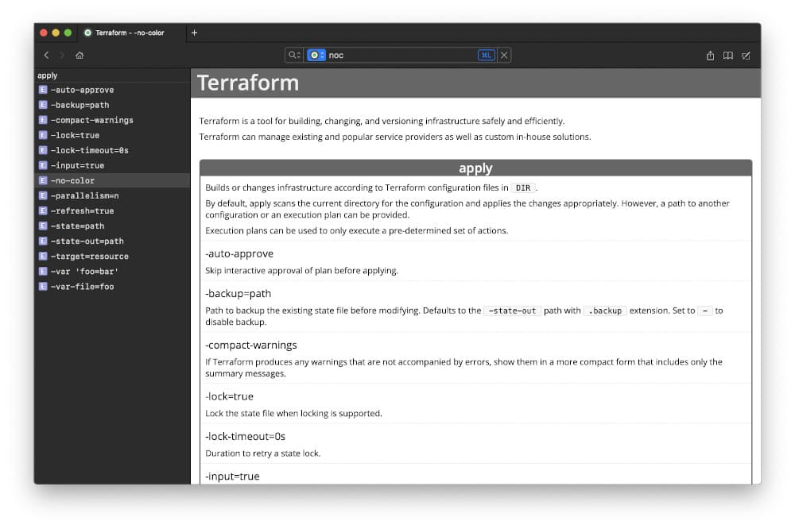

Terraform cheat sheet
-----

This repository is intended to generate the cheat sheet for [Dash](https://kapeli.com/dash).

Dash is an API Documentation Browser and Code Snippet Manager. Dash instantly searches offline documentation sets for 200+ APIs, 100+ cheat sheets and more. You can even generate your own docsets or request docsets to be included.

## Instalation

1. [Download the latest docset](https://github.com/mijailr/terraform-dash/releases/latest)
2. Import to dash

